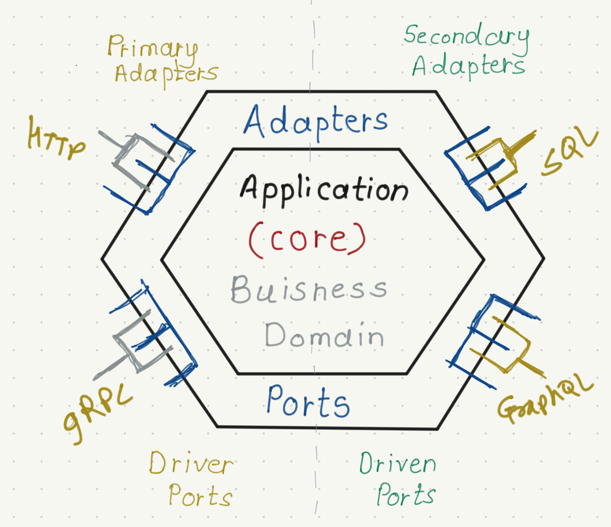

# Hexagonal Architecture Pattern

The Hexagonal Architecture, also known as Ports and Adapters, is a software architecture pattern that was introduced by Alistair Cockburn in 2005. It was designed to rectify shortcomings present in the layered architecture style, where monolith applications integrate the user interface and data persistence within a tightly coupled structure comprising presentation, business logic, and persistent layers. 

## Motivation highlighted by Alistair
- **Testing Challenges:** Hexagonal architecture addresses difficulties in automated testing caused by dynamic visual details like field size and button placement.
- **Transition Hurdles:** The pattern mitigates obstacles in transitioning from human-driven to batch-run systems, ensuring smooth operational shifts.
- **Program Integration:** Hexagonal architecture enables the seamless integration of programs driving the system, overcoming limitations imposed by intricate visual dependencies.





## ToDo API - Hexagonal Way
 
Sample ToDo API using Hexagonal Architecture Pattern

```
$ # clone githib.com/jittakal/todo-api-hexagonal
# cd todo-api-hexagonal
```

```
$ make run
$ # OR
$ go run cmd/main.go
$ # OR
$ go run cmd/main.go --handler=http --repository=in-memory
$ # OR
$ go run cmd/main.go --handler=grpc --repository=in-memory
```

Sample GRPC Client
```
# go run client/main.go
```
